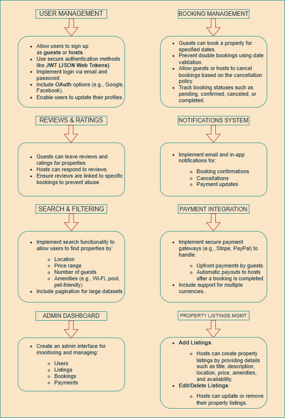

# Project Features and Functionalities

## Objective
This document provides a detailed overview of the core features and functionalities required for the backend of the Airbnb Clone project. It serves as a blueprint for the development team, ensuring all essential components are identified and understood before the coding phase begins.

---

## Key Features and Functional Breakdown
The backend system is designed to support the following major functionalities, which are essential for a robust and scalable rental marketplace.

### 1. User Management
* **User Registration**: Allows new users to sign up as a guest or host.
* **User Authentication**: Implements secure login using email and password, with support for JSON Web Tokens (JWT) for session management.
* **Profile Management**: Enables users to view and update their personal information and profile photos.

### 2. Property Listings
* **Create Listing**: Hosts can add new property listings, including details like title, description, location, price, and amenities.
* **Manage Listings**: Hosts have the ability to edit or delete their existing property listings.

### 3. Search and Discovery
* **Search Functionality**: Users can search for properties based on various criteria, including location, price range, number of guests, and available amenities.
* **Filtering & Sorting**: Supports advanced filtering options to refine search results.

### 4. Booking System
* **Booking Creation**: Guests can book a property for specific dates. The system includes logic to prevent double bookings.
* **Booking Management**: Hosts and guests can view, manage, and cancel bookings.
* **Booking Status**: The system tracks the status of each booking (e.g., pending, confirmed, canceled).

### 5. Payment Integration
* **Secure Payments**: Integrates with third-party payment gateways like Stripe or PayPal to handle secure transactions.
* **Payouts**: Facilitates automatic payouts to hosts after a booking is completed.

### 6. Reviews and Ratings
* **Review Submission**: Guests can submit reviews and ratings for properties they have stayed at.
* **Host Responses**: Hosts can respond to reviews left by guests.
* **Review Validation**: Links reviews to specific bookings to ensure authenticity.

### 7. Notifications and Admin
* **Notifications**: Implements a system for sending email or in-app notifications for important events like booking confirmations or cancellations.
* **Admin Dashboard**: Provides a centralized interface for administrators to monitor and manage users, listings, bookings, and payments.

---

## Visual Representation
An image of the features and functionalities diagram is included below to provide a clear, visual overview of the system's architecture.

